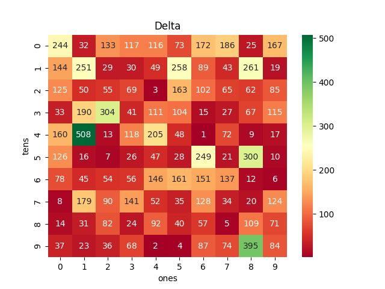
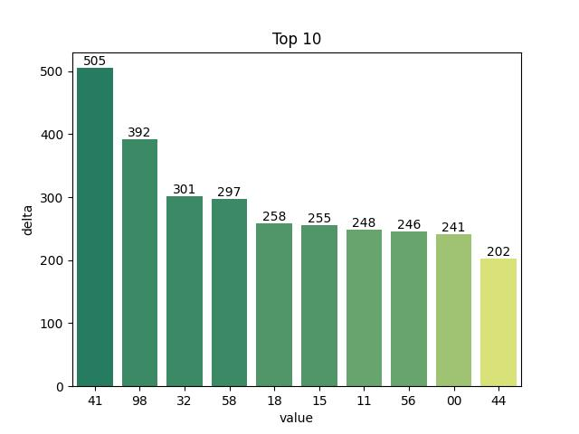
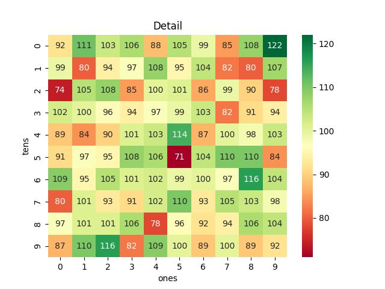
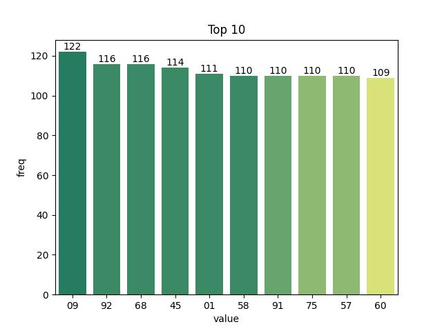
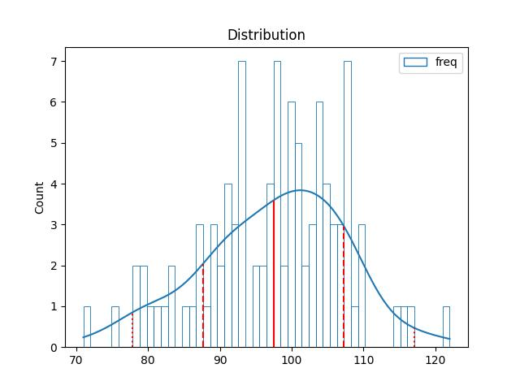
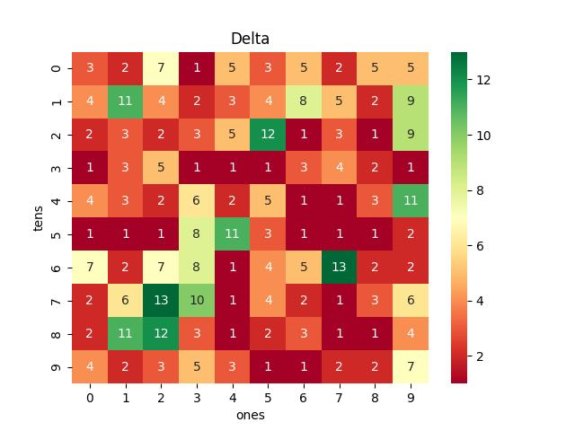
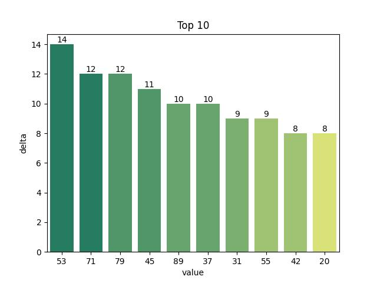

# Vietnam Lottery (XSMB) Analysis

Using GitHub Action to automatically fetch and analyze results of the Vietnam lottery daily.

Download:

* [Full data](https://raw.githubusercontent.com/khiemdoan/vietnam-lottery-xsmb-analysis/main/results/xsmb.csv)
* [1-year data](https://raw.githubusercontent.com/khiemdoan/vietnam-lottery-xsmb-analysis/main/results/xsmb_1_year.csv)
* [2-year data](https://raw.githubusercontent.com/khiemdoan/vietnam-lottery-xsmb-analysis/main/results/xsmb_2_year.csv)
* [3-year data](https://raw.githubusercontent.com/khiemdoan/vietnam-lottery-xsmb-analysis/main/results/xsmb_3_year.csv)
* [5-year data](https://raw.githubusercontent.com/khiemdoan/vietnam-lottery-xsmb-analysis/main/results/xsmb_5_year.csv)

| Lotery      | Loto |
| :-----------: | :-----------: |
| <table><tr><td>Date</td><td>12-05-2023</td></tr><tr><td>Special</td><td>84102</td></tr><tr><td>First</td><td>12141</td></tr><tr><td>Second</td><td>03914, 59392</td></tr><tr><td rowspan="2">Third</td><td>89476, 73718, 53418</td></tr><tr><td>26470, 04401, 87540</td></tr><tr><td>Fourth</td><td>9810, 7384, 5603, 4657</td></tr><tr><td rowspan="2">Fifth</td><td>1245, 1444, 2197</td></tr><tr><td>7581, 5850, 1090</td></tr><tr><td>Sixth</td><td>531, 230, 371</td></tr><tr><td>Seventh</td><td>43, 75, 65, 00</td></tr></table> | <table><tr><td>First</td><td>Last</td></tr><tr><td>0</td><td>0, 1, 2, 3</td></tr><tr><td>1</td><td>0, 4, 8, 8</td></tr><tr><td>2</td><td>-</td></tr><tr><td>3</td><td>0, 1</td></tr><tr><td>4</td><td>0, 1, 3, 4, 5</td></tr><tr><td>5</td><td>0, 7</td></tr><tr><td>6</td><td>5</td></tr><tr><td>7</td><td>0, 1, 5, 6</td></tr><tr><td>8</td><td>1, 4</td></tr><tr><td>9</td><td>0, 2, 7</td></tr></table> |

<h2>Analysis of special prices</h2>

<h3>Amount of day from last appearing</h3>

<h3>Top 10 amount of day from last appearing</h3>

<h2>Analysis of one-year results</h2>

Max: 119. Min: 73.

Mean: 97.47. Standard deviation: 10.46.

<h3>Detail</h3>

<h3>Top 10</h3>

<h3>Distribution</h3>

<h2>Amount of day from last appearing</h2>

<h3>Top 10 amount of day from last appearing</h3>

