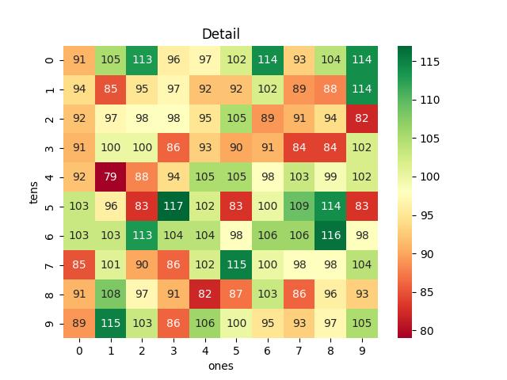

# Vietnam Lottery (XSMB) Analysis

Using GitHub Action to automatically fetch and analyze results of the Vietnam lottery daily.

| Lotery      | Loto |
| :-----------: | :-----------: |
| <table><tr><td>Date</td><td>15-01-2023</td></tr><tr><td>Special</td><td>44221</td></tr><tr><td>First</td><td>25945</td></tr><tr><td>Second</td><td>14590, 57392</td></tr><tr><td rowspan="2">Third</td><td>84792, 14379, 92716</td></tr><tr><td>86841, 87280, 96564</td></tr><tr><td>Fourth</td><td>7401, 4194, 1991, 5569</td></tr><tr><td rowspan="2">Fifth</td><td>9333, 9812, 3708</td></tr><tr><td>3904, 1078, 2104</td></tr><tr><td>Sixth</td><td>938, 566, 749</td></tr><tr><td>Seventh</td><td>45, 57, 00, 28</td></tr></table> | <table><tr><td>First</td><td>Last</td></tr><tr><td>0</td><td>0, 1, 4, 4, 8</td></tr><tr><td>1</td><td>2, 6</td></tr><tr><td>2</td><td>1, 8</td></tr><tr><td>3</td><td>3, 8</td></tr><tr><td>4</td><td>1, 5, 5, 9</td></tr><tr><td>5</td><td>7</td></tr><tr><td>6</td><td>4, 6, 9</td></tr><tr><td>7</td><td>8, 9</td></tr><tr><td>8</td><td>0</td></tr><tr><td>9</td><td>0, 1, 2, 2, 4</td></tr></table> |

<h2>Analysis of one-year results</h2>

Max: 126. Min: 73.

Mean: 97.47. Standard deviation: 11.5.

<h3>Detail</h3>

<h3>Top 10</h3>

<h3>Distribution</h3>

