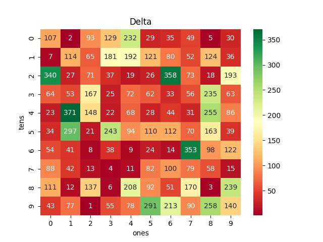

# Vietnam Lottery (XSMB) Analysis

Using GitHub Action to automatically fetch and analyze results of the Vietnam lottery daily.

Download:

* [Full data](https://raw.githubusercontent.com/khiemdoan/vietnam-lottery-xsmb-analysis/main/results/xsmb.csv)
* [1-year data](https://raw.githubusercontent.com/khiemdoan/vietnam-lottery-xsmb-analysis/main/results/xsmb_1_year.csv)
* [2-year data](https://raw.githubusercontent.com/khiemdoan/vietnam-lottery-xsmb-analysis/main/results/xsmb_2_year.csv)
* [3-year data](https://raw.githubusercontent.com/khiemdoan/vietnam-lottery-xsmb-analysis/main/results/xsmb_3_year.csv)
* [5-year data](https://raw.githubusercontent.com/khiemdoan/vietnam-lottery-xsmb-analysis/main/results/xsmb_5_year.csv)

| Lotery      | Loto |
| :-----------: | :-----------: |
| <table><tr><td>Date</td><td>27-03-2023</td></tr><tr><td>Special</td><td>83230</td></tr><tr><td>First</td><td>27431</td></tr><tr><td>Second</td><td>64284, 25717</td></tr><tr><td rowspan="2">Third</td><td>00542, 39074, 03807</td></tr><tr><td>48505, 81972, 52585</td></tr><tr><td>Fourth</td><td>3688, 5158, 4819, 5996</td></tr><tr><td rowspan="2">Fifth</td><td>1953, 7838, 0600</td></tr><tr><td>4430, 1433, 9408</td></tr><tr><td>Sixth</td><td>989, 736, 316</td></tr><tr><td>Seventh</td><td>91, 85, 30, 55</td></tr></table> | <table><tr><td>First</td><td>Last</td></tr><tr><td>0</td><td>0, 5, 7, 8</td></tr><tr><td>1</td><td>6, 7, 9</td></tr><tr><td>2</td><td>-</td></tr><tr><td>3</td><td>0, 0, 0, 1, 3, 6, 8</td></tr><tr><td>4</td><td>2</td></tr><tr><td>5</td><td>3, 5, 8</td></tr><tr><td>6</td><td>-</td></tr><tr><td>7</td><td>2, 4</td></tr><tr><td>8</td><td>4, 5, 5, 8, 9</td></tr><tr><td>9</td><td>1, 6</td></tr></table> |

<h2>Analysis of special prices</h2>

<h3>Amount of day from last appearing</h3>

<h3>Top 10 amount of day from last appearing</h3>

<h2>Analysis of one-year results</h2>

Max: 122. Min: 72.

Mean: 97.47. Standard deviation: 11.32.

<h3>Detail</h3>

<h3>Top 10</h3>

<h3>Distribution</h3>

<h2>Amount of day from last appearing</h2>

<h3>Top 10 amount of day from last appearing</h3>

