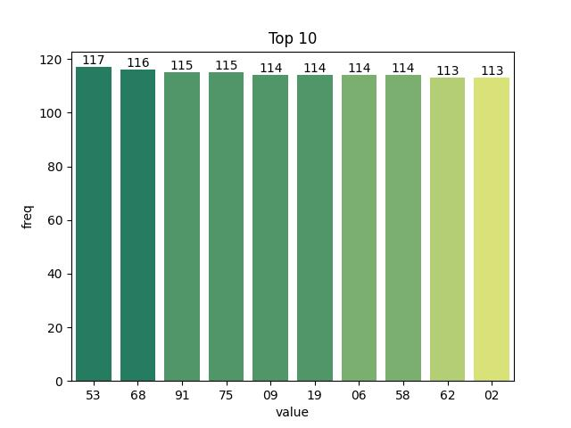
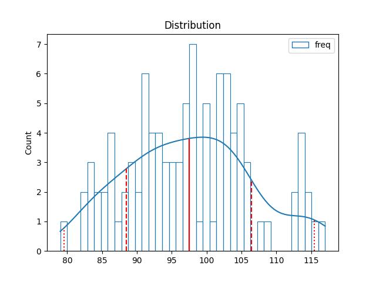

# Vietnam Lottery (XSMB) Analysis

Using GitHub Action to automatically fetch and analyze results of the Vietnam lottery daily.

Download:

* [Full data](https://raw.githubusercontent.com/khiemdoan/vietnam-lottery-xsmb-analysis/main/results/xsmb.csv)
* [1-year data](https://raw.githubusercontent.com/khiemdoan/vietnam-lottery-xsmb-analysis/main/results/xsmb_1_year.csv)
* [2-year data](https://raw.githubusercontent.com/khiemdoan/vietnam-lottery-xsmb-analysis/main/results/xsmb_2_year.csv)
* [3-year data](https://raw.githubusercontent.com/khiemdoan/vietnam-lottery-xsmb-analysis/main/results/xsmb_3_year.csv)
* [5-year data](https://raw.githubusercontent.com/khiemdoan/vietnam-lottery-xsmb-analysis/main/results/xsmb_5_year.csv)

| Lotery      | Loto |
| :-----------: | :-----------: |
| <table><tr><td>Date</td><td>05-04-2024</td></tr><tr><td>Special</td><td>72666</td></tr><tr><td>First</td><td>96992</td></tr><tr><td>Second</td><td>52918, 21197</td></tr><tr><td rowspan="2">Third</td><td>21034, 45765, 73219</td></tr><tr><td>29010, 02370, 06089</td></tr><tr><td>Fourth</td><td>0372, 6291, 4099, 0369</td></tr><tr><td rowspan="2">Fifth</td><td>7007, 0315, 6233</td></tr><tr><td>7010, 2611, 6123</td></tr><tr><td>Sixth</td><td>270, 306, 325</td></tr><tr><td>Seventh</td><td>05, 13, 49, 19</td></tr></table> | <table><tr><td>First</td><td>Last</td></tr><tr><td>0</td><td>5, 6, 7</td></tr><tr><td>1</td><td>0, 0, 1, 3, 5, 8, 9, 9</td></tr><tr><td>2</td><td>3, 5</td></tr><tr><td>3</td><td>3, 4</td></tr><tr><td>4</td><td>9</td></tr><tr><td>5</td><td>-</td></tr><tr><td>6</td><td>5, 6, 9</td></tr><tr><td>7</td><td>0, 0, 2</td></tr><tr><td>8</td><td>9</td></tr><tr><td>9</td><td>1, 2, 7, 9</td></tr></table> |

<h2>Analysis of special prices</h2>

<h3>Amount of day from last appearing</h3>

<h3>Top 10 amount of day from last appearing</h3>

<h2>Analysis of one-year results</h2>

Max: 125. Min: 72.

Mean: 97.74. Standard deviation: 9.08.

<h3>Detail</h3>

<h3>Top 10</h3>

<h3>Distribution</h3>

<h2>Amount of day from last appearing</h2>

<h3>Top 10 amount of day from last appearing</h3>

