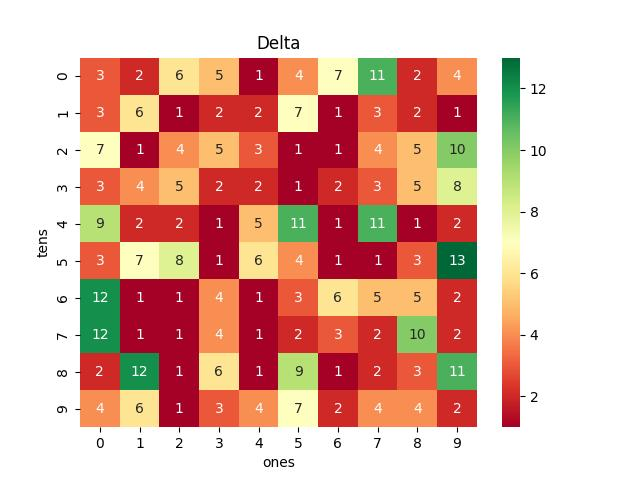

# Vietnam Lottery (XSMB) Analysis

Using GitHub Action to automatically fetch and analyze results of the Vietnam lottery daily.

| Lotery      | Loto |
| :-----------: | :-----------: |
| <table><tr><td>Date</td><td>05-03-2023</td></tr><tr><td>Special</td><td>58118</td></tr><tr><td>First</td><td>72226</td></tr><tr><td>Second</td><td>98850, 15773</td></tr><tr><td rowspan="2">Third</td><td>71749, 51632, 31209</td></tr><tr><td>50187, 40158, 45441</td></tr><tr><td>Fourth</td><td>5688, 2460, 5843, 0309</td></tr><tr><td rowspan="2">Fifth</td><td>4886, 9358, 5870</td></tr><tr><td>7416, 4769, 2711</td></tr><tr><td>Sixth</td><td>963, 478, 989</td></tr><tr><td>Seventh</td><td>55, 01, 37, 62</td></tr></table> | <table><tr><td>First</td><td>Last</td></tr><tr><td>0</td><td>1, 9, 9</td></tr><tr><td>1</td><td>1, 6, 8</td></tr><tr><td>2</td><td>6</td></tr><tr><td>3</td><td>2, 7</td></tr><tr><td>4</td><td>1, 3, 9</td></tr><tr><td>5</td><td>0, 5, 8, 8</td></tr><tr><td>6</td><td>0, 2, 3, 9</td></tr><tr><td>7</td><td>0, 3, 8</td></tr><tr><td>8</td><td>6, 7, 8, 9</td></tr><tr><td>9</td><td>-</td></tr></table> |

<h2>Analysis of one-year results</h2>

Max: 124. Min: 71.

Mean: 97.47. Standard deviation: 11.68.

<h3>Detail</h3>

<h3>Top 10</h3>

<h3>Distribution</h3>

<h2>Amount of day from last appearing</h2>

<h3>Top 10 amount of day from last appearing</h3>

