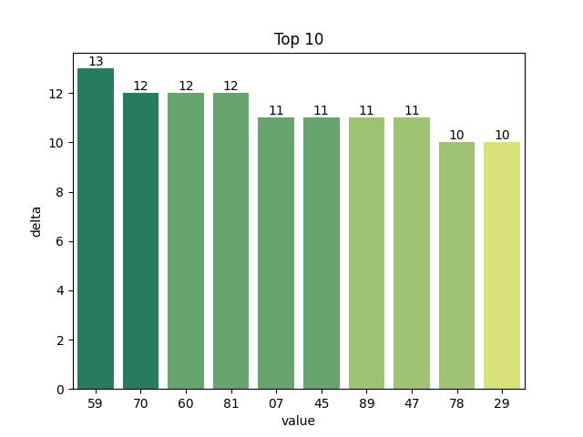

# Vietnam Lottery (XSMB) Analysis

Using GitHub Action to automatically fetch and analyze results of the Vietnam lottery daily.

| Lotery      | Loto |
| :-----------: | :-----------: |
| <table><tr><td>Date</td><td>07-03-2023</td></tr><tr><td>Special</td><td>75877</td></tr><tr><td>First</td><td>08692</td></tr><tr><td>Second</td><td>87361, 31241</td></tr><tr><td rowspan="2">Third</td><td>06055, 87073, 97510</td></tr><tr><td>52584, 52539, 03248</td></tr><tr><td>Fourth</td><td>9565, 5285, 8430, 3314</td></tr><tr><td rowspan="2">Fifth</td><td>4666, 6378, 7540</td></tr><tr><td>2000, 6823, 1143</td></tr><tr><td>Sixth</td><td>444, 841, 655</td></tr><tr><td>Seventh</td><td>00, 04, 38, 45</td></tr></table> | <table><tr><td>First</td><td>Last</td></tr><tr><td>0</td><td>0, 0, 4</td></tr><tr><td>1</td><td>0, 4</td></tr><tr><td>2</td><td>3</td></tr><tr><td>3</td><td>0, 8, 9</td></tr><tr><td>4</td><td>0, 1, 1, 3, 4, 5, 8</td></tr><tr><td>5</td><td>5, 5</td></tr><tr><td>6</td><td>1, 5, 6</td></tr><tr><td>7</td><td>3, 7, 8</td></tr><tr><td>8</td><td>4, 5</td></tr><tr><td>9</td><td>2</td></tr></table> |

<h2>Analysis of one-year results</h2>

Max: 124. Min: 71.

Mean: 97.47. Standard deviation: 11.76.

<h3>Detail</h3>

<h3>Top 10</h3>

<h3>Distribution</h3>

<h2>Amount of day from last appearing</h2>

<h3>Top 10 amount of day from last appearing</h3>

